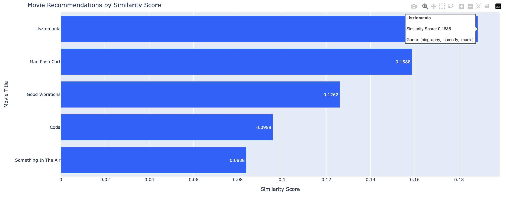

# Movie Recommendation System

A content-based movie recommendation system that suggests movies based on plot similarities using TF-IDF and cosine similarity.

## Dataset

The system uses the `movie_plots_trimmed.csv` dataset, which is a trimmed version of the [Movie Plots from Wikipedia](https://www.kaggle.com/datasets/kartikeychauhan/movie-plots) dataset on kaggle. which should be placed in the root directory of the project.

## Setup

### Prerequisites
- Python 3.8 or higher
- pip

### Installation

1. Create and activate a virtual environment:
```bash
# Create virtual environment
python -m venv venv

# Activate virtual environment
# On Windows:
venv\Scripts\activate
# On macOS/Linux:
source venv/bin/activate
```

2. Install dependencies:
```bash
pip install -r requirements.txt
```

## Running the System

The recommendation system can be run from the command line using:

```bash
python recommend.py "your movie preferences description" --num 5
```

Parameters:
- First argument: Your movie preferences or description (required)
- `--num`: Number of recommendations to return (optional, default=5)

Example:
```bash
python recommend.py "Music and love are what I look for"
```

## Example Output

For the query "Music and love are what I look for":

```
Top Recommendations:

1. Lisztomania
   Similarity Score: 0.1885
   Genre: [biography,  comedy,  music]

2. Man Push Cart
   Similarity Score: 0.1588
   Genre: [drama]

3. Good Vibrations
   Similarity Score: 0.1262
   Genre: [biography,  drama,  music]

4. Coda
   Similarity Score: 0.0958
   Genre: [drama,  music]

5. Something In The Air
   Similarity Score: 0.0838
   Genre: [drama]
```

The system will also display an interactive visualization showing the recommendations and their similarity scores. Hover over the bars to see additional information about each movie.


